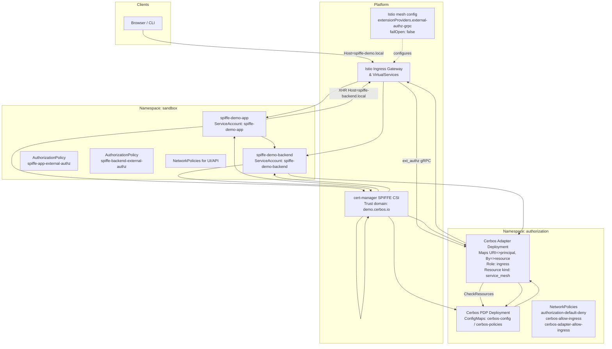
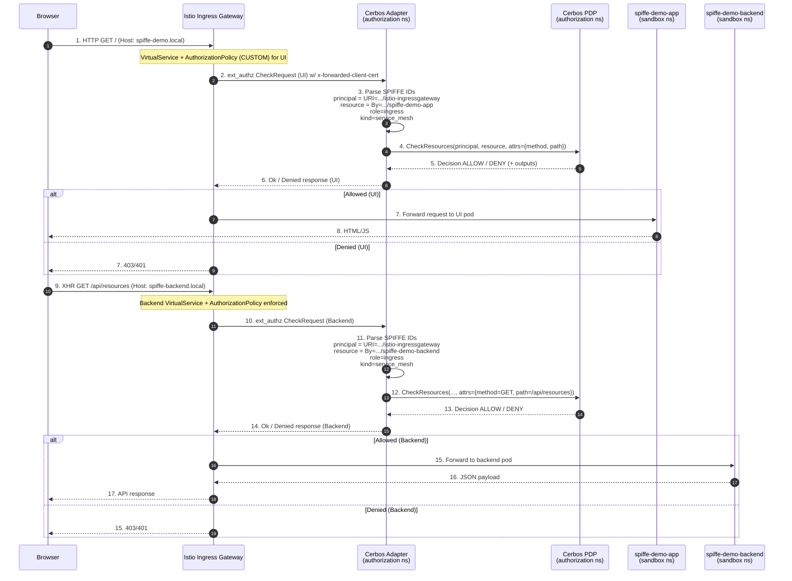

# Istio SPIFFE + Cerbos External Authorization Blueprint

Demonstration platform for system architects who want to plug Cerbos policy decisions into Istio’s external authorization filter using SPIFFE-derived workload identities. The environment shows how to:

- Issue SPIFFE certificates with cert-manager, surface them to workloads, and project identity to Envoy via the XFCC header.
- Route ingress traffic through Istio, invoke a gRPC adapter for every request, and translate Envoy metadata into Cerbos `CheckResources` calls.
- Enforce policies that tie principals and resources to SPIFFE URIs, fail closed when the authorizer is unavailable, and observe the effect without touching application code.

---

## 1. Topology at a Glance



**Topology callouts**

1. User traffic enters through the Istio ingress gateway, which applies VirtualService routing rules.
2. Mesh config installs the `external-authz-grpc` provider pointing to the Cerbos adapter with `failOpen: false`.
3. `spiffe-demo-app` and `spiffe-demo-backend` run in the `sandbox` namespace, each with its own SPIFFE-enabled ServiceAccount and AuthorizationPolicy.
4. NetworkPolicies in `sandbox` enforce least privilege ingress, permitting only Istio and expected in-namespace callers.
5. The `authorization` namespace hosts the Cerbos adapter and PDP, guarded by default-deny NetworkPolicies with explicit allow rules for Istio and sandbox workloads.
6. The adapter maps Istio’s SPIFFE identities (URI/By) into Cerbos principals/resources (`service_mesh`, role `ingress`) and forwards decisions back to Envoy.
7. cert-manager’s SPIFFE CSI driver provisions certificates for every participating pod, ensuring mTLS identity is available to Envoy via the XFCC header.

---

## 2. Request Lifecycle



**Lifecycle callouts**

1. Browser hits the UI host; Istio evaluates a `CUSTOM` AuthorizationPolicy and forwards an ext_authz request.
2. Adapter receives Envoy metadata (including XFCC) and extracts ingress SPIFFE (principal) and UI SPIFFE (resource).
3. Cerbos evaluates the `service_mesh` policy for the UI request and returns allow/deny.
4. On allow, Istio proxies to the UI pod; otherwise it returns 401/403 immediately.
5. The loaded UI issues an XHR to the backend host, triggering a second ext_authz check.
6. Adapter remaps identities (principal = ingress, resource = backend), preserving HTTP attributes.
7. Cerbos enforces backend-specific rules; allow leads to proxying to the backend pod, deny short-circuits at the gateway.

### Identity & Policy Mapping

- **Principal** → SPIFFE URI extracted from `URI=` (Istio ingress service account).
- **Resource** → SPIFFE URI from `By=` (calling workload) + Cerbos resource kind `service_mesh`.
- **Attributes** → HTTP method & path supplied by Envoy.
- **Role** → Static `ingress`; policies constrain to namespaces and trust domain.
- **Fail behaviour** → Mesh config sets `failOpen: false` to block traffic if the adapter/Cerbos are unavailable.

---

## 3. Components Overview

| Layer           | Component                                | Purpose                                                                                                               |
| --------------- | ---------------------------------------- | --------------------------------------------------------------------------------------------------------------------- |
| Ingress         | Istio Gateway + VirtualServices          | Routes traffic for `spiffe-demo.local` and `spiffe-backend.local`, invokes external authorization.                    |
| External Auth   | Cerbos Adapter (Go)                      | gRPC server implementing Envoy `ext_authz`. Parses XFCC header, builds Cerbos request, proxies outputs back to Envoy. |
| Policy Decision | Cerbos PDP (ConfigMaps)                  | Evaluates `service_mesh` policies against SPIFFE principals/resources.                                                |
| Workloads       | `spiffe-demo-app`, `spiffe-demo-backend` | Sample UI + API with SPIFFE mTLS certificates via CSI driver.                                                         |
| Identity        | cert-manager SPIFFE CSI driver           | Issues SPIFFE X.509 certs under trust domain `demo.cerbos.io`.                                                        |
| Security        | NetworkPolicies                          | Namespace-specific ingress controls; adapter & PDP accessible only from expected callers.                             |

---

## 4. Getting Started

### Prerequisites

- Docker
- Minikube
- kubectl
- helm
- cmctl (auto-installed by setup script)

### Bootstrap the Environment

```bash
./setup.sh
```

> The script provisions the `sandbox` and `authorization` namespaces, installs cert-manager + SPIFFE CSI driver, deploys Istio, spins up the adapter + Cerbos PDP, builds demo workloads, configures VirtualServices, NetworkPolicies, and sets up port forwarding (8088 → Istio ingress).

### Validate Access

1. Add hosts entry:
   ```
   127.0.0.1 spiffe-demo.local spiffe-backend.local
   ```
2. UI: http://spiffe-demo.local:8088
3. API via gateway:
   ```bash
   curl -H "Host: spiffe-backend.local" http://localhost:8088/api/resources
   ```
4. Observe adapter decisions:
   ```bash
   kubectl logs -n authorization deploy/cerbos-adapter -f
   ```

---

## 5. Managing Policies

Cerbos policies reside in the `cerbos-policies` ConfigMap (authorization namespace). Changes take effect after updating the ConfigMap and restarting the Cerbos deployment.

1. **Review current rule set**
   ```bash
   kubectl get configmap cerbos-policies -n authorization -o jsonpath='{.data.resource_policy\.yaml}' | yq
   ```
2. **Deny backend requests**
   - Remove the `EFFECT_ALLOW` stanza for role `api`.
   - Apply change: `kubectl edit configmap cerbos-policies -n authorization`
   - Restart PDP: `kubectl rollout restart deployment/cerbos -n authorization`
   - Result: UI XHR now receives 403 (adapter logs show `DENY`).
3. **Constrain by path and namespace**
   - Adjust condition block to require `resource.attr.method == "GET"` and SPIFFE path `/ns/sandbox`.
   - Redeploy as above; backend call succeeds only when criteria match.
4. **Emit response metadata**
   - Add an `outputs` section (e.g., `{"x-decision-source": "cerbos"}`).
   - After restart, capture headers in browser dev tools or `curl -v`.

### Scenario Playbook

| Scenario | What to Change | Expected Result | How to Observe |
|----------|----------------|-----------------|----------------|
| Lock down backend | Remove `EFFECT_ALLOW` for role `api` | UI XHR to `/api/resources` fails with 403 | Browser network tab, adapter logs show `DENY` |
| Namespace-aware allow | Require `spiffeID(P.id).path().contains("/ns/sandbox")` and limit to `method == "GET"` | Only sandbox workloads succeed; spoofed namespaces are denied | Modify policy, rerun `curl` with alternate SPIFFE (see adapter logs) |
| Introduce response metadata | Add `outputs` map with custom header | Envoy injects header (e.g., `x-decision-source: cerbos`) into upstream response | `curl -v`, browser dev tools, Istio access logs |
| Fail-open experiment | Temporarily set mesh config `failOpen: true` and restart adapter | During adapter outage requests succeed (fail open) | `kubectl scale deploy/cerbos-adapter --replicas=0 -n authorization`, observe responses |
| SPIFFE trust-domain check | Change policy to require `spiffeMatchTrustDomain("spiffe://demo.cerbos.io")` | Access allowed only when SPIFFE trust domain matches | Edit policy and simulate alternate trust domain via tests or logs |

---

## 6. Operational Notes

- **Fail-closed external auth**: Mesh config sets `failOpen: false`. Expect traffic disruption if adapter/Cerbos go offline.
- **Namespace isolation**: Separate `authorization` namespace isolates PDP + adapter; NetworkPolicies admit only Istio and sandbox workloads.
- **Certificate issuance**: cert-manager CSI driver mounts SPIFFE certs at `/var/run/secrets/spiffe.io/` for every pod.
- **Logging**: Adapter redacts Authorization & XFCC headers, but logs principal/resource IDs for auditing.

---

## 7. Teardown

```bash
# Stop workloads and port forwarding
./cleanup.sh

# Remove the Minikube profile entirely
./cleanup.sh --delete-minikube
```

---

## 8. Reference Material

- [Cerbos Documentation](https://docs.cerbos.dev/)
- [Istio External Authorization](https://istio.io/latest/docs/tasks/security/authorization/authz-custom/)
- [SPIFFE & SPIRE](https://spiffe.io/docs/)
- [cert-manager SPIFFE CSI Driver](https://cert-manager.io/docs/usage/csi-driver-spiffe/)
- [Kubernetes Network Policies](https://kubernetes.io/docs/concepts/services-networking/network-policies/)
