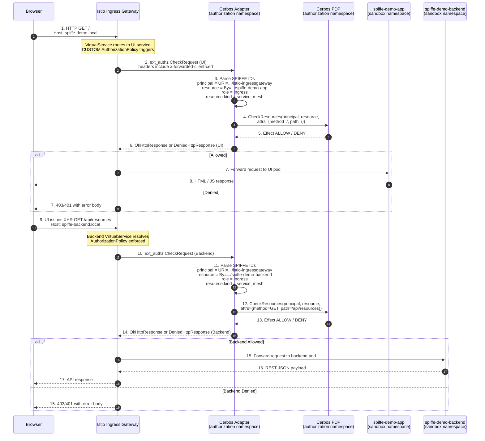
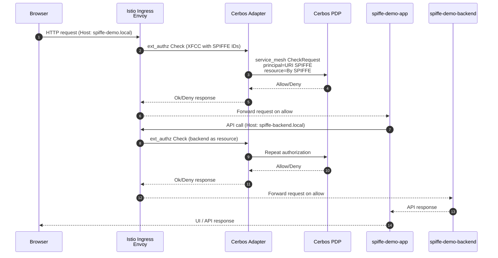

# Istio SPIFFE + Cerbos External Authorization Demo

This repository showcases a service mesh-ready reference implementation that wires Istio's external authorization filter to Cerbos using SPIFFE identities, providing end-to-end identity-aware policy enforcement across frontend and backend workloads running on Kubernetes.

## Overview

The demo consists of:

1. **SPIFFE Demo App** - A Node.js/Express web UI that displays the current SPIFFE identity and certificate information
2. **SPIFFE Demo Backend** - A REST API service that demonstrates SPIFFE identity extraction and Cerbos authorization
3. **Cerbos PDP** - Policy Decision Point that evaluates authorization policies based on SPIFFE identities
4. **Cerbos Envoy Adapter** - A Go gRPC server that plugs into Istio external authorization and translates SPIFFE context into Cerbos checks
5. **cert-manager SPIFFE CSI Driver** - Automatically issues and mounts SPIFFE certificates to pods

## Architecture



1. **Browser → Istio:** User loads the frontend (`Host: spiffe-demo.local`). Istio’s ingress gateway matches the VirtualService and triggers the `CUSTOM` AuthorizationPolicy bound to the UI deployment.
2. **Istio → Adapter (UI):** Envoy sends an ext_authz gRPC `CheckRequest` containing the request metadata and SPIFFE identities in the `x-forwarded-client-cert` header.
3. **Adapter (UI parse):** The adapter extracts the Istio ingress SPIFFE (`URI=`) as the principal ID, the frontend SPIFFE (`By=`) as the `service_mesh` resource ID, and assigns the static `ingress` role.
4. **Adapter → Cerbos (UI):** A `CheckResources` call is made with the principal, the `service_mesh` resource (path `/`), and request attributes (`method`, `path`).
5. **Cerbos decision (UI):** Cerbos evaluates embedded policies and returns `ALLOW` or `DENY` (with optional outputs).
6. **Adapter → Istio (UI result):** The adapter replies with an `OkHttpResponse` or `DeniedHttpResponse`, which Istio honors.
   7-8. **UI request outcome:** On allow, Istio forwards the HTTP request to the `spiffe-demo-app` pod, which serves HTML/JS back to the browser. On deny, Istio short-circuits with 403/401 and the flow stops.
7. **Browser → Istio (API):** The frontend issues an XHR call to `/api/resources` (`Host: spiffe-backend.local`), kicking off the backend flow.
8. **Istio → Adapter (Backend):** Another ext_authz `CheckRequest` is sent, this time representing the backend workload.
9. **Adapter (Backend parse):** The adapter again uses the ingress SPIFFE as principal and the backend SPIFFE as the resource ID (still `service_mesh` kind, `ingress` role).
10. **Adapter → Cerbos (Backend):** A second `CheckResources` call is made with `method=GET` and `path=/api/resources`.
11. **Cerbos decision (Backend):** Cerbos responds with allow/deny based on policy and identity.
12. **Adapter → Istio (Backend result):** The adapter passes the gRPC outcome back to Istio.
    15-17. **Backend request outcome:** If allowed, Istio proxies the call to `spiffe-demo-backend`, collects the JSON payload, and returns it to the browser. If denied, Istio responds directly with 403/401 and no backend traffic occurs.

## Quick Start

### Prerequisites

- Docker
- minikube
- kubectl
- helm
- cmctl (will be installed automatically if missing)

### Setup

```bash
./setup.sh
```

The script will:

- Start minikube with profile 'zero-trust'
- Install cert-manager (v1.18.2) with SPIFFE CSI driver
- Configure trust domain as `demo.cerbos.io`
- Enable Istio addons in minikube and turn on sidecar injection for the `sandbox` and `authorization` namespaces
- Deploy Cerbos PDP with authorization policies in the `authorization` namespace
- Build Docker images for demo applications
- Deploy demo applications to sandbox namespace
- Configure an Istio gateway and virtual services for external access
- Apply namespace-scoped Kubernetes NetworkPolicies to both namespaces
- Register an Istio external authorization provider and attach it to both demo workloads via `CUSTOM` AuthorizationPolicies
- Approve certificate requests automatically
- Set up port forwarding

### Access the Applications

Once setup is complete:

- **SPIFFE Demo App**: http://localhost:8080
- **SPIFFE Demo Backend**: http://localhost:8081

The applications will have SPIFFE identities in the format:
`spiffe://demo.cerbos.io/ns/sandbox/sa/{service-account}`

### Access via Istio Ingress Gateway

The cluster now exposes the demo services through the shared Istio ingress gateway. To exercise the gateway locally:

```bash
kubectl port-forward -n istio-system svc/istio-ingressgateway 8088:80
```

Then add the following entries to your `/etc/hosts` (or equivalent) so your browser resolves the virtual hosts:

```
127.0.0.1 spiffe-demo.local spiffe-backend.local
```

With the port-forward in place you can browse to `http://spiffe-demo.local:8088` for the UI or call the backend with `curl -H 'Host: spiffe-backend.local' http://localhost:8088/api/resources`.

### Pluggable External Authorization

Setup appends an `external-authz-grpc` extension provider to the Istio mesh config and applies a `CUSTOM` `AuthorizationPolicy` across both demo workloads (frontend and backend). The provider targets `cerbos-adapter-service.authorization.svc.cluster.local:9090` with a 3s timeout and `failOpen` disabled so traffic fails closed if the authorizer is unavailable.

To wire in your service later:

1. Deploy your external authorization server in the `authorization` namespace with the DNS name `cerbos-adapter-service.authorization.svc.cluster.local` (or update the mesh config to match your preferred address) listening on gRPC port `9090`. Update the provider block if you need a different address or protocol.
2. Once the service is healthy, edit the mesh config (`kubectl edit configmap istio -n istio-system`) if you need to revert to `failOpen: true` for fail-open semantics.
3. Extend the server to evaluate the SPIFFE identity propagated by Istio (available in the `x-forwarded-client-cert` header) along with any other request metadata you require.

The bundled adapter already implements this mapping: it reads the SPIFFE URI from the `URI=` entry (Istio ingress identity) as the Cerbos principal, uses the `By=` SPIFFE URI (calling workload) as the `service_mesh` resource ID, and forwards the HTTP method and path as resource attributes under the `service_mesh` resource kind. Requests arrive under a fixed `ingress` role.

If you need to disable the external check temporarily, delete the policy with `kubectl delete -f spiffe-backend-authz-policy.yaml` until the authorizer is ready.

### Request Flow



## Cleanup

To clean up the demo environment:

```bash
# Stop applications and port forwarding (keeps minikube running)
./cleanup.sh

# Completely remove minikube cluster
./cleanup.sh --delete-minikube
```

## Resources

- [SPIFFE Documentation](https://spiffe.io/docs/)
- [cert-manager SPIFFE CSI Driver](https://cert-manager.io/docs/usage/csi-driver-spiffe/)
- [Cerbos Documentation](https://docs.cerbos.dev/)
- [Kubernetes CSI Documentation](https://kubernetes-csi.github.io/docs/)

## Network Policies

Ingress-focused Kubernetes `NetworkPolicy` objects are applied to the `sandbox` and `authorization` namespaces:

- Each namespace has a default deny that blocks all ingress traffic unless explicitly allowed.
- Per-application allowlists in `sandbox` accept traffic from the Istio ingress gateway (`istio-system`), readiness probes (`kube-system`), and the expected in-namespace callers (frontend → backend).
- The `authorization` namespace scopes access so only the SPIFFE backend (`sandbox`) and the Cerbos adapter can reach the Cerbos PDP, while Istio callers in `sandbox`/`istio-system` are allowed to reach the adapter on port 9090.

Egress remains open for now, which keeps Envoy sidecars free to talk to Istiod while still constraining inbound flows to the minimum required set.
