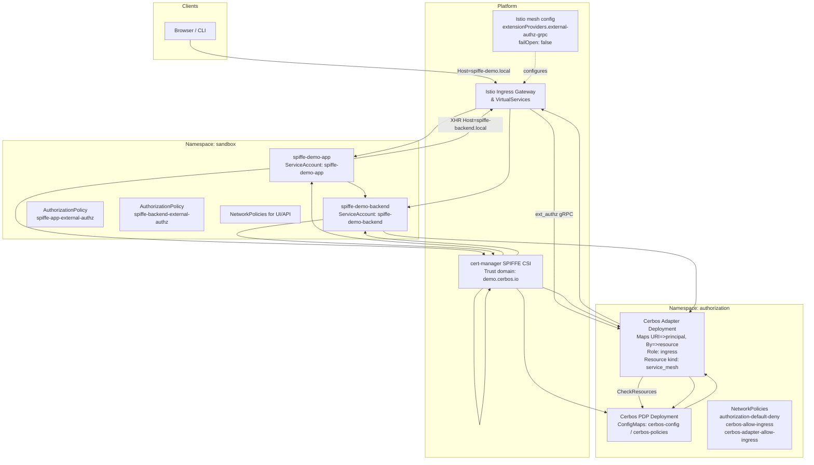
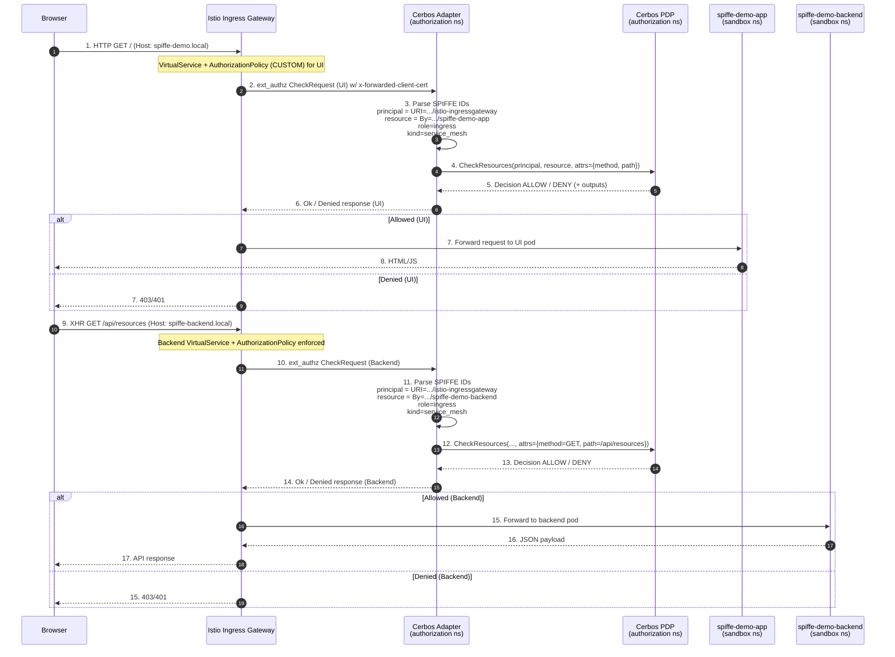

# Istio SPIFFE + Cerbos External Authorization Blueprint

Demonstration platform for system architects who want to plug Cerbos policy decisions into Istio’s external authorization filter using SPIFFE-derived workload identities. The environment shows how to:

- Issue SPIFFE certificates with cert-manager, surface them to workloads, and project identity to Envoy via the XFCC header.
- Route ingress traffic through Istio, invoke a gRPC adapter for every request, and translate Envoy metadata into Cerbos `CheckResources` calls.
- Enforce policies that tie principals and resources to SPIFFE URIs, fail closed when the authorizer is unavailable, and observe the effect without touching application code.

---

## 1. Topology at a Glance



**Topology callouts**

1. **Browser → Istio** – All ingress traffic hits the Istio Gateway, which terminates TLS (if configured) and applies VirtualService routing.
2. **Istio → UI service** – Requests for `spiffe-demo.local` are routed to the frontend workload in the `sandbox` namespace.
3. **UI → Istio (XHR)** – The UI makes internal calls to `spiffe-backend.local`, sending traffic back through the ingress gateway for consistent policy enforcement.
4. **Istio → Cerbos adapter** – Every request (UI and backend) triggers Envoy’s external authorization filter, invoking the adapter in the `authorization` namespace.
5. **Adapter → Cerbos PDP** – The adapter converts SPIFFE identities from the XFCC header into Cerbos principals/resources and asks for a decision.
6. **Cerbos → Adapter → Istio → Backend** – Allow decisions flow back through the adapter to Envoy, which then proxies traffic to the backend service; denies stop at the gateway.
7. **cert-manager SPIFFE CSI** – The CSI driver mounts SPIFFE certificates into each pod (UI, backend, adapter, Cerbos) so Envoy can project identities into XFCC.
8. **Mesh config → Istio** – Cluster-wide mesh configuration registers the `external-authz-grpc` provider (pointing to the adapter) and sets `failOpen: false`.

---

## 2. Request Lifecycle



**Lifecycle callouts**

1. Browser issues the initial GET for the UI host; Istio captures the request and selects the frontend VirtualService while invoking the `CUSTOM` AuthorizationPolicy.
2. Istio sends an ext_authz `CheckRequest` to the adapter, including the XFCC header with SPIFFE identities and HTTP metadata.
3. Adapter parses SPIFFE IDs: principal = ingressgateway SPIFFE (from `URI=`), resource = UI SPIFFE (from `By=`), role = `ingress`, resource kind = `service_mesh`.
4. Adapter calls Cerbos `CheckResources`, passing the mapped principal/resource and HTTP attributes (`method`, `path`).
5. Cerbos evaluates policies and returns an ALLOW or DENY decision (optionally with outputs).
6. Adapter responds to Istio with an OK or Denied message, mirroring the Cerbos decision.
7. **Allowed branch (UI)** – Istio forwards the request to the `spiffe-demo-app` pod because Cerbos allowed the operation.
8. UI pod responds with HTML/JS, completing the initial page load back to the browser.
9. **Denied branch (UI)** – If Cerbos denied the UI request, Istio replies directly with 401/403 and the flow stops (no backend call occurs).
10. After the page loads, the browser issues an XHR to `/api/resources` (backend host) to fetch data.
11. Istio again calls the adapter with an ext_authz request for the backend path.
12. Adapter remaps identities for the backend call: principal = ingressgateway SPIFFE, resource = backend SPIFFE, role still `ingress`, kind `service_mesh`.
13. Adapter sends the second `CheckResources` call to Cerbos with method `GET` and path `/api/resources`.
14. Cerbos returns a decision for the backend request.
15. Adapter relays the decision to Istio (Ok or Denied).
16. **Allowed branch (Backend)** – Istio proxies the call to the `spiffe-demo-backend` pod because access was granted.
17. Backend responds with JSON payload for the UI.
18. Istio forwards the JSON response to the browser, completing the data fetch. If step 13 returned DENY, Istio instead short-circuits with 401/403 (shown as the alternative branch at step 15).

### Identity & Policy Mapping

- **Principal** → SPIFFE URI extracted from `URI=` (Istio ingress service account).
- **Resource** → SPIFFE URI from `By=` (calling workload) + Cerbos resource kind `service_mesh`.
- **Attributes** → HTTP method & path supplied by Envoy.
- **Role** → Static `ingress`; policies constrain to namespaces and trust domain.
- **Fail behaviour** → Mesh config sets `failOpen: false` to block traffic if the adapter/Cerbos are unavailable.

---

## 3. Components Overview

| Layer           | Component                                | Purpose                                                                                                               |
| --------------- | ---------------------------------------- | --------------------------------------------------------------------------------------------------------------------- |
| Ingress         | Istio Gateway + VirtualServices          | Routes traffic for `spiffe-demo.local` and `spiffe-backend.local`, invokes external authorization.                    |
| External Auth   | Cerbos Adapter (Go)                      | gRPC server implementing Envoy `ext_authz`. Parses XFCC header, builds Cerbos request, proxies outputs back to Envoy. |
| Policy Decision | Cerbos PDP (ConfigMaps)                  | Evaluates `service_mesh` policies against SPIFFE principals/resources.                                                |
| Workloads       | `spiffe-demo-app`, `spiffe-demo-backend` | Sample UI + API with SPIFFE mTLS certificates via CSI driver.                                                         |
| Identity        | cert-manager SPIFFE CSI driver           | Issues SPIFFE X.509 certs under trust domain `demo.cerbos.io`.                                                        |
| Security        | NetworkPolicies                          | Namespace-specific ingress controls; adapter & PDP accessible only from expected callers.                             |

---

## 4. Getting Started

### Prerequisites

- Docker
- Minikube
- kubectl
- helm
- cmctl (auto-installed by setup script)

### Bootstrap the Environment

```bash
./setup.sh
```

> The script provisions the `sandbox` and `authorization` namespaces, installs cert-manager + SPIFFE CSI driver, deploys Istio, spins up the adapter + Cerbos PDP, builds demo workloads, configures VirtualServices, NetworkPolicies, and sets up port forwarding (8088 → Istio ingress).

### Validate Access

1. Add hosts entry:
   ```
   127.0.0.1 spiffe-demo.local spiffe-backend.local
   ```
2. UI: http://spiffe-demo.local:8088
3. API via gateway:
   ```bash
   curl -H "Host: spiffe-backend.local" http://localhost:8088/api/resources
   ```
4. Observe adapter decisions:
   ```bash
   kubectl logs -n authorization deploy/cerbos-adapter -f
   ```

---

## 5. Managing Policies

Cerbos policies reside in the `cerbos-policies` ConfigMap (authorization namespace). Changes take effect after updating the ConfigMap and restarting the Cerbos deployment.

1. **Review current rule set**
   ```bash
   kubectl get configmap cerbos-policies -n authorization -o jsonpath='{.data.resource_policy\.yaml}' | yq
   ```
2. **Deny backend requests**
   - Remove the `EFFECT_ALLOW` stanza for role `api`.
   - Apply change: `kubectl edit configmap cerbos-policies -n authorization`
   - Restart PDP: `kubectl rollout restart deployment/cerbos -n authorization`
   - Result: UI XHR now receives 403 (adapter logs show `DENY`).
3. **Constrain by path and namespace**
   - Adjust condition block to require `resource.attr.method == "GET"` and SPIFFE path `/ns/sandbox`.
   - Redeploy as above; backend call succeeds only when criteria match.
4. **Emit response metadata**
   - Add an `outputs` section (e.g., `{"x-decision-source": "cerbos"}`).
   - After restart, capture headers in browser dev tools or `curl -v`.

### Scenario Playbook

| Scenario                    | What to Change                                                                         | Expected Result                                                                 | How to Observe                                                       |
| --------------------------- | -------------------------------------------------------------------------------------- | ------------------------------------------------------------------------------- | -------------------------------------------------------------------- |
| Lock down backend           | Remove `EFFECT_ALLOW` for role `api`                                                   | UI XHR to `/api/resources` fails with 403                                       | Browser network tab, adapter logs show `DENY`                        |
| Namespace-aware allow       | Require `spiffeID(P.id).path().contains("/ns/sandbox")` and limit to `method == "GET"` | Only sandbox workloads succeed; spoofed namespaces are denied                   | Modify policy, rerun `curl` with alternate SPIFFE (see adapter logs) |
| Introduce response metadata | Add `outputs` map with custom header                                                   | Envoy injects header (e.g., `x-decision-source: cerbos`) into upstream response | `curl -v`, browser dev tools, Istio access logs                      |
| SPIFFE trust-domain check   | Change policy to require `spiffeMatchTrustDomain("spiffe://demo.cerbos.io")`           | Access allowed only when SPIFFE trust domain matches                            | Edit policy and simulate alternate trust domain via tests or logs    |

---

## 6. Operational Notes

- **Fail-closed external auth**: Mesh config sets `failOpen: false`. Expect traffic disruption if adapter/Cerbos go offline.
- **Namespace isolation**: Separate `authorization` namespace isolates PDP + adapter; NetworkPolicies admit only Istio and sandbox workloads.
- **Certificate issuance**: cert-manager CSI driver mounts SPIFFE certs at `/var/run/secrets/spiffe.io/` for every pod.
- **Logging**: Adapter redacts Authorization & XFCC headers, but logs principal/resource IDs for auditing.

---

## 7. Teardown

```bash
# Stop workloads and port forwarding
./cleanup.sh

# Remove the Minikube profile entirely
./cleanup.sh --delete-minikube
```

---

## 8. Reference Material

- [Cerbos Documentation](https://docs.cerbos.dev/)
- [Istio External Authorization](https://istio.io/latest/docs/tasks/security/authorization/authz-custom/)
- [SPIFFE & SPIRE](https://spiffe.io/docs/)
- [cert-manager SPIFFE CSI Driver](https://cert-manager.io/docs/usage/csi-driver-spiffe/)
- [Kubernetes Network Policies](https://kubernetes.io/docs/concepts/services-networking/network-policies/)
